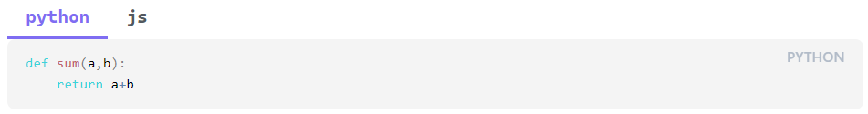

# Obsidian Code Tab

在 Obsidian 中加入可切换的标签页。

## 语法

用 `tab` 触发代码块，内部使用 `tab: 标题` 分隔每个标签。
渲染之后可任意切换 tab 以查看对应的内容。

示例

````
```tab
tab: 标题1
内容1
tab: 标题2
内容2
```
````


如果想在标签内加入代码块，应使用四个 ` 。

`````
````tab

tab: python
```python
def sum(a,b):
    return a+b
```

tab: js
```js
function sum(a, b) {
  return a + b;
}
```

````
`````


